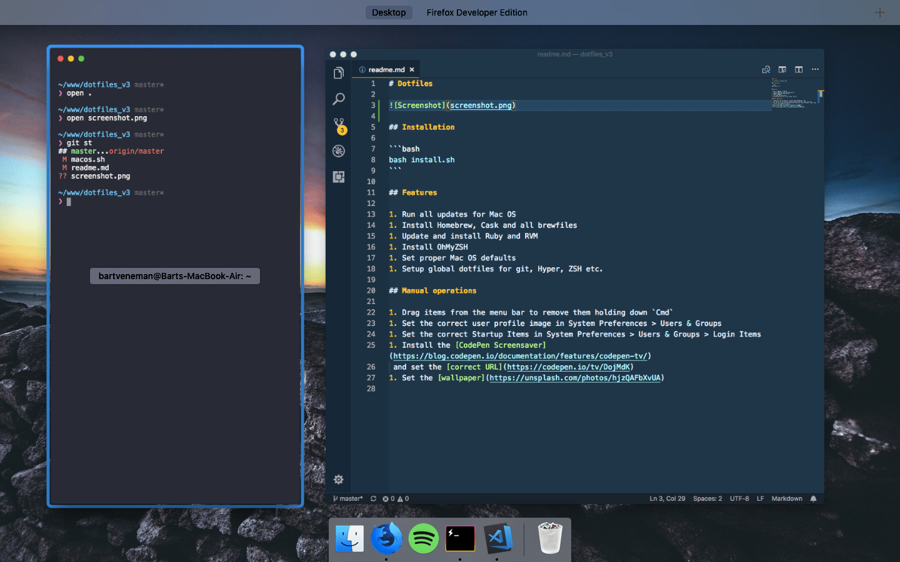

# Dotfiles



## Installation

```bash
bash install.sh
```

## Features

1. Run all updates for Mac OS
1. Install Homebrew, Cask and all brewfiles
1. Update and install Ruby and RVM
1. Install OhMyZSH
1. Set proper Mac OS defaults
1. Setup global dotfiles for git, Hyper, ZSH etc.

## Manual operations

1. Drag items from the menu bar to remove them holding down `Cmd`
1. Set the correct user profile image in System Preferences > Users & Groups
1. Set the correct Startup Items in System Preferences > Users & Groups > Login Items
1. Install the [CodePen Screensaver](https://blog.codepen.io/documentation/features/codepen-tv/)
 and set the [correct URL](https://codepen.io/tv/DojMdK)
